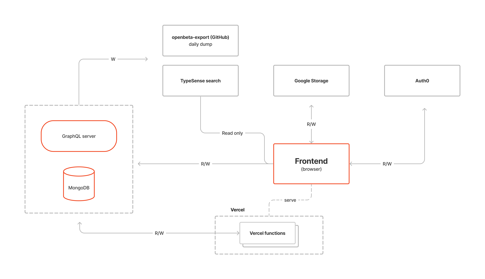

# 🧗‍♂️ OpenBeta – Rock Climbing Route Catalog

**OpenBeta** is an open-source platform that helps climbers explore and share climbing routes, areas, and related data.  
This repository (`open-tacos`) contains the **web application** built using modern web technologies like **Next.js**, **React**, and **TailwindCSS**.

---

## 🌍 Live Website

👉 [https://openbeta.io](https://openbeta.io)

Join the community on Discord → [OpenBeta Discord](https://discord.gg/BQnFJxFnrQ)

---

## 🧰 Tech Stack

- **Frontend:** Next.js, React, Tailwind CSS  
- **Backend:** Apollo GraphQL, Node.js  
- **Database:** MongoDB  
- **TypeScript:** For type-safe and consistent codebase  

---

## 🧠 Project Overview

OpenBeta collects, stores, and displays climbing route information in a structured, searchable, and user-friendly way.  
The project encourages contributions from the global climbing community to keep the data open and accurate.



---

## 🚀 Getting Started (Local Development)

Follow these steps to set up OpenBeta on your local machine:

### 1️⃣ Clone the Repository
```bash
git clone https://github.com/OpenBeta/open-tacos.git
cd open-tacos
